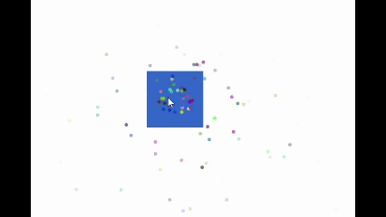

# Haxe Demo – Click-&-Particle Prototype

One-evening prototype:

- Sprite rendering
- Keyboard movement
- Click-triggered particle burst with gravity & fade
## Live demo
https://rekemer.github.io/haxe-demo/

## to setup
```
haxelib install lime
haxelib install openfl

haxelib run lime setup
haxelib run openfl setup
```
## to run
```
openfl test html5 
```